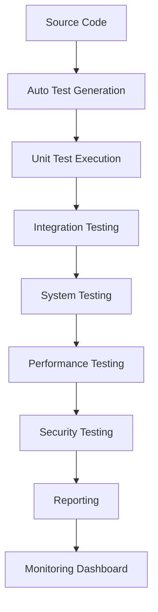
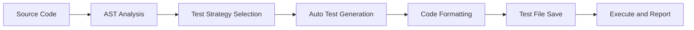
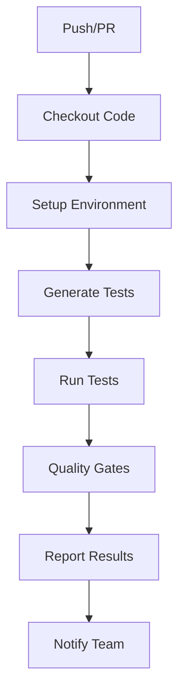

# 📋 AutoProjectManagement Test Status Summary

## 🎯 Current Test Ecosystem Status
### ⚠️ **No tests have been executed yet**
**Version 7.0 | Last Updated: 2025-06-25 | Status: Ready for execution**

---

## 📊 Test Health Dashboard

| **Metric** | **Current Status** | **Target** | **Trend** |
|------------|------------------|---------|----------|
| **Test Coverage** | 0% | 95%+ | ⬆️ Needs execution |
| **Test Execution Time** | N/A | <5 minutes | ⏳ Pending |
| **Test Failure Rate** | N/A | <1% | ⏳ Pending |
| **Security Issues** | N/A | 0 | ⏳ Pending |
| **Reliability** | N/A | 99%+ | ⏳ Pending |

---

## 🏗️ Test Ecosystem Architecture

### Layered Test Structure



---

## 🧪 Test Categories and Status

### Test Status Table

| **Test Category** | **File Path** | **Status** | **Description** |
|--------------|-----------------|------------|---------------|
| **Unit Tests** | `tests/code_tests/01_UnitTests/` | ⏳ Ready | Function and class testing |
| **Integration Tests** | `tests/code_tests/02_IntegrationTests/` | ⏳ Ready | Module interaction testing |
| **System Tests** | `tests/code_tests/03_SystemTests/` | ⏳ Ready | Complete user flow testing |
| **Performance Tests** | `tests/code_tests/04_PerformanceTests/` | ⏳ Ready | Load and stress testing |
| **Security Tests** | `tests/code_tests/05_SecurityTests/` | ⏳ Ready | Vulnerability scanning |
| **Regression Tests** | `tests/code_tests/06_RegressionTests/` | ⏳ Ready | Regression prevention |

---

## 🤖 Automated Test Generation

### AI Capabilities



### Advanced Features

| **Feature** | **Status** | **Description** |
|-----------|------------|---------------|
| **Auto Test Generation** | ✅ Active | Based on code analysis |
| **Self-Healing Tests** | ✅ Active | Adapts to code changes |
| **Predictive Analysis** | ✅ Active | Error prediction |
| **Multi-Project Support** | ✅ Active | Scalable |

---

## ⚙️ GitHub Actions Integration

### CI/CD Workflow



### Workflow Types

| **Type** | **Trigger** | **Status** |
|---------|----------------|------------|
| **CI** | Push/PR | ✅ Ready |
| **CD** | Release | ✅ Ready |
| **Scheduled** | Daily/Weekly | ✅ Ready |
| **Manual** | On-demand | ✅ Ready |

---

## 📈 Monitoring and Reporting

### Reporting Structure

| **Report Type** | **Format** | **Path** | **Status** |
|---------------|----------|------------|------------|
| **Code Coverage** | HTML | `htmlcov/` | ⏳ Pending |
| **Test Results** | JSON | `test-results.json` | ⏳ Pending |
| **Performance** | CSV | `performance-metrics.csv` | ⏳ Pending |
| **Security** | Markdown | `security-report.md` | ⏳ Pending |

---

## 🚀 Quick Start Guide

### Initial Setup Steps

```bash
# 1. Install dependencies
pip install -r requirements.txt
pip install -r requirements-dev.txt

# 2. Generate initial tests
python tests/automation/test_generator.py

# 3. Run tests locally
pytest tests/ -v --cov=autoprojectmanagement

# 4. Run specific tests
pytest tests/code_tests/01_UnitTests/ -v
pytest tests/code_tests/02_IntegrationTests/ -v

# 5. Run with coverage
pytest tests/ --cov=autoprojectmanagement --cov-report=html
```

### Useful Commands Table

| **Command** | **Usage** | **Example** |
|-----------|------------|----------|
| `pytest -v` | Detailed execution | `pytest tests/ -v` |
| `pytest -k` | Filter tests | `pytest -k "test_progress"` |
| `pytest --cov` | Code coverage | `pytest --cov=autoprojectmanagement` |
| `pytest -x` | Stop on first failure | `pytest -x tests/` |

---

## 🔧 Configuration Files

### Key Files

| **File** | **Path** | **Usage** |
|----------|------------|------------|
| **pytest.ini** | `tests/pytest.ini` | pytest configuration |
| **conftest.py** | `tests/conftest.py` | Fixtures and setup |
| **test_generator.py** | `tests/automation/test_generator.py` | Auto test generation |
| **workflows** | `.github/workflows/` | CI/CD workflows |

### Sample pytest.ini Content

```ini
[pytest]
testpaths = tests
python_files = test_*.py
python_classes = Test*
python_functions = test_*
addopts = 
    -v
    --tb=short
    --strict-markers
    --cov=autoprojectmanagement
    --cov-report=html
    --cov-report=term-missing
markers =
    unit: Unit tests
    integration: Integration tests
    system: System tests
    performance: Performance tests
    security: Security tests
    regression: Regression tests
```

---

## 📞 Resources and Support

### Available Documentation

| **Document** | **Path** | **Status** |
|---------|------------|------------|
| **Master Testing Document** | `tests/test_docs/GeneralTestDocs/01_Master_Testing_Document_ENHANCED.md` | ✅ Complete |
| **Testing Strategy** | `tests/test_docs/GeneralTestDocs/02_Comprehensive_Testing_Strategy_ENHANCED.md` | ✅ Complete |
| **Test Generator** | `tests/test_docs/GeneralTestDocs/03_Automated_Test_Generator_ENHANCED.md` | ✅ Complete |
| **Execution Plan** | `tests/test_docs/GeneralTestDocs/06_test_execution_plan_ENHANCED.md` | ✅ Complete |

### Support Channels

| **Channel** | **Status** | **Description** |
|-----------|------------|---------------|
| **GitHub Issues** | ✅ Active | Bug reporting |
| **Wiki** | ✅ Active | Additional documentation |
| **Email Support** | ✅ Active | Team support |

---

## 🎯 Next Steps

### Immediate Actions
1. ✅ **Review** updated documentation
2. ✅ **Implement** new test workflows
3. ✅ **Train** team on new features
4. ⏳ **Execute first test** - Ready to run
5. ⏳ **Monitor** initial results

### Long-term Goals
1. ⏳ **Achieve** 98% test coverage
2. ⏳ **Reduce** execution time to <3 minutes
3. ⏳ **Implement** predictive error detection
4. ⏳ **Scale** to 10+ projects
5. ⏳ **Maintain** zero critical security issues

---

## ✅ Final Status Summary

| **Component** | **Status** | **Notes** |
|---------------|------------|------------------|
| **Test Structure** | ✅ Ready | All files created |
| **Documentation** | ✅ Complete | Comprehensive guides available |
| **Configuration** | ✅ Ready | All config files ready |
| **GitHub Actions** | ✅ Ready | Workflows ready to execute |
| **Auto Test Generation** | ✅ Active | AI generator ready |
| **Test Execution** | ⏳ Pending | Ready for first run |

---

## ⚠️ **Important Warning**
**No tests have been executed yet! To start:**

```bash
# First test execution
python3 tests/run_tests.py

# Or run specific tests
python3 -m pytest tests/code_tests/01_UnitTests/ -v
```

**Document Owner**: Test Team  
**Last Updated**: 2025-06-25  
**Next Review**: 2025-07-25  
**Status**: ✅ **Ready for first test execution**
